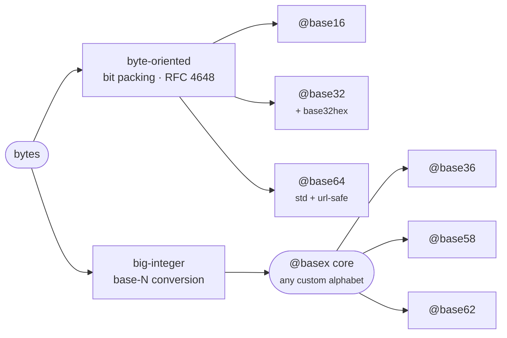

<div align="center">

# basex

**base16 · base32 · base36 · base58 · base62 · base64 for [MoonBit](https://www.moonbitlang.com/)**

The base codecs you actually reach for — the RFC 4648 byte codecs, plus a small generic base-N core behind base36/base58/base62 — each pinned to its authoritative test vectors.

[](https://github.com/Lfan-ke/basex-moonbit/actions)
[](#tests)
[](https://lfan-ke.github.io/basex-moonbit/)
[](https://mooncakes.io/docs/Lfan-ke/basex)
[](LICENSE)

</div>

`basex` turns bytes into short, copy-safe text and back.

| Package | What it is | Kind |
|---|---|---|
| `@base16` | RFC 4648 hexadecimal | byte-oriented (2 chars/byte) |
| `@base32` | RFC 4648 `A-Z2-7` + base32hex `0-9A-V` | byte-oriented (5 bytes → 8 chars) |
| `@base36` | dense case-insensitive `0-9a-z`, plus an integer mode | big-integer base-N |
| `@base58` | the Bitcoin / IPFS alphabet (`0OIl` dropped) | big-integer base-N |
| `@base62` | URL-safe `0-9A-Za-z`, plus an integer mode | big-integer base-N |
| `@base64` | RFC 4648 standard `+/` and URL-safe `-_` | byte-oriented (3 bytes → 4 chars) |

Two implementation families, one façade:



## Install

```bash
moon add Lfan-ke/basex
```

## base16

RFC 4648 hexadecimal. Byte-oriented, so every byte — including a leading `0x00` — is preserved as two characters (a big-integer base conversion would drop a leading zero nibble). `decode` accepts either case.

```moonbit
@base16.encode(b"\x00\x0f\xff")   // -> "000fff"   (leading zero survives)
@base16.encode_upper(b"foobar")   // -> "666F6F626172"  (RFC 4648 canonical)
@base16.decode("DeAdBeEf")        // -> Some(b"\xde\xad\xbe\xef")
@base16.decode("abc")             // -> None  (odd length)
```

## base32

RFC 4648: standard (`A-Z2-7`, the alphabet TOTP secrets use) and base32hex (`0-9A-V`, which keeps byte sort order). Both `=`-padded; `decode` tolerates missing padding.

```moonbit
@base32.encode(b"foobar")     // -> "MZXW6YTBOI======"
@base32.decode("MZXW6YTBOI")  // -> Some(b"foobar")  (padding optional)

@base32.encode_hex(b"foobar") // -> "CPNMUOJ1E8======"
@base32.decode_hex("CPNMUOJ1E8======") // -> Some(b"foobar")
```

## base36

The densest encoding that stays case-insensitive and alphanumeric (`0-9a-z`) — the common shape for human-facing short ids. Bytes mode round-trips arbitrary data; integer mode matches JavaScript's `n.toString(36)`.

```moonbit
@base36.encode(b"\xde\xad\xbe\xef") // bytes  -> a base36 string
@base36.decode("...")               // string -> Some(bytes) / None

@base36.encode_uint(123456789)      // -> "21i3v9"   (== (123456789).toString(36))
@base36.decode_uint("21i3v9")       // -> Some(123456789)
```

## base58

The alphabet Bitcoin addresses and IPFS CIDv0 hashes use. Leading zero bytes are preserved as leading `1`s.

```moonbit
let encoded = @base58.encode(b"Hello, MoonBit!")
let decoded = @base58.decode(encoded) // -> Some(b"Hello, MoonBit!")

@base58.decode("0OIl") // -> None  (none of these are base58 characters)
```

## base62

Bytes in, URL-safe text out — plus an integer mode that is the compact form a URL shortener gives a numeric id.

```moonbit
@base62.encode(b"\xde\xad\xbe\xef") // bytes  -> a base62 string
@base62.decode("...")               // string -> Some(bytes) / None

@base62.encode_uint(123456789)      // -> "8M0kX"
@base62.decode_uint("8M0kX")        // -> Some(123456789)
```

## base64

RFC 4648: standard (`+/`, `=`-padded) and URL-safe (`-_`, unpadded). `decode` tolerates missing padding.

```moonbit
@base64.encode(b"foobar")      // -> "Zm9vYmFy"
@base64.encode(b"f")           // -> "Zg=="
@base64.decode("Zm9vYg")       // -> Some(b"foob")  (padding optional)

@base64.encode_url(b"\xfb\xff\xbf") // -> "-_-_"  (never + / or =)
@base64.decode_url("-_-_")          // -> Some(b"\xfb\xff\xbf")
```

## Custom alphabets

base36/base58/base62 are thin wrappers over the `@basex` core. Build an `Alphabet` from any ordered set of ASCII characters (the first is the zero digit) and encode against it. The core reads the input as one big-endian integer and rewrites it in the target base — so for **byte-exact** hex use `@base16`, and reach for the core when you want base-N over a custom alphabet:

```moonbit
let base36 = @basex.Alphabet::new("0123456789abcdefghijklmnopqrstuvwxyz")
@basex.encode(b"\xde\xad\xbe\xef", base36) // -> a base36 string
@basex.decode("...", base36)               // -> Some(bytes) / None
```

`decode` returns `None` on any character outside the alphabet, so it doubles as validation.

## Tests

Correctness is pinned to published vectors: **base16 / base32 / base64 to the RFC 4648 §10 vectors**, **base58 to Bitcoin Core's `base58_encode_decode.json`**, **base36's integer mode to JavaScript's `toString(36)`**, base62's integer mode to hand-computed values, and every codec to encode/decode round-trips.

```bash
moon test
```

## License

Apache-2.0 © Leo Cheng
